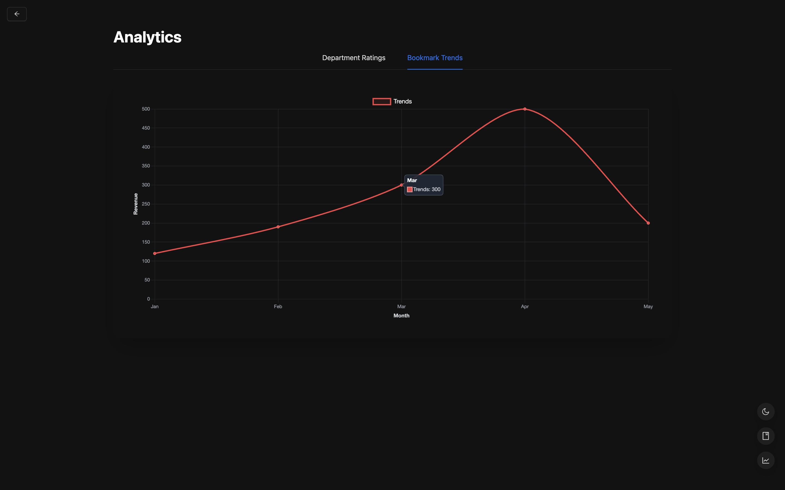

# Sample HR Website

This is a [Next.js](https://nextjs.org) project bootstrapped with [`create-next-app`](https://nextjs.org/docs/app/api-reference/cli/create-next-app). It provides a modern HR management interface with support for theme switching, analytics, user bookmarks, and more.

---

### Public Repo Link https://github.com/yelisetty-suresh-babu/sampleHR

## 🚀 Getting Started

Follow the steps below to set up the project locally:

```bash
# Clone the repository
git clone https://github.com/yelisetty-suresh-babu/sampleHR

or

Unzip the Zip File

# Navigate to the project directory
cd sampleHR

or 

cd into the unzipped folder

# Install dependencies
npm install

# Start the development server
npm run dev
```

Visit [http://localhost:3000](http://localhost:3000) in your browser to view the application.

---

## 🎯 Core Features (Must Have)

### 1. 🏠 Dashboard Homepage (`/`)

- Fetch and display dummy user data from [`https://dummyjson.com/users?limit=20`](https://dummyjson.com/users?limit=20).
- Render user cards with:

  - Full Name, Email, Age, Department (mocked)
  - Performance rating (1–5 stars)
  - Actions: `View`, `Bookmark`, `Promote`

  ## 📸 Screenshot

<p align="center">
  
  
</p>

### 2. 🔍 Search & Filter

- Filter users by name, email, or department (case-insensitive).
- Multi-select dropdown to filter by department or performance rating.

<p align="center">
  
  
</p>
  <p align="center">
  
  
</p>

### 3. 👤 Dynamic User Details Page (`/employee/[id]`)

- Display detailed user profile:

  - Address, Phone, Bio (mocked), Performance history
  - Rating stars, colored badges

- Tabbed UI with:

  - `Overview`, `Projects`, `Feedback` (dynamic content loading)
  <p align="center">
    
    
  </p>

### 4. 📌 Bookmark Manager (`/bookmarks`)

- List of all bookmarked employees.
- Features:

  - Remove bookmarks
  - Trigger UI actions like `Promote` or `Assign to Project`
  <p align="center">
    
    
  </p>

### 5. 📊 Analytics Page (`/analytics`)

- Charts showing:

  - Department-wise average performance ratings
  - Bookmark trends (mocked)

- Built with Chart.js or similar library
- Optional: SSR or static generation
<p align="center">
  
  
</p>
  <p align="center">
  
  
</p>

---

## 🌟 Additional Features

- **Responsive UI** with Tailwind CSS and Ant Design
- **Dark/Light Mode** toggle with full Ant Design support
- **Floating Action Buttons** for quick access to Bookmarks and Analytics
- **Animated Backgrounds** with `BackgroundBeams` component
- **Robust Error Handling** using custom React Error Boundaries

---

## 💻 Tech Stack

- **Framework**: Next.js (App Router)
- **UI Libraries**: Tailwind CSS, Ant Design
- **Icons**: Lucide React, Ant Design Icons
- **Theming**: `next-themes` + Ant Design `ConfigProvider`
- **State Management**: Zustand
- **Data Viz**: Chart.js (or Recharts)

---

## 📂 Folder Structure

```
sampleHR/
├── app/                # Next.js App Router pages
├── components/         # Reusable UI components
├── hooks/              # Custom React hooks
├── lib/                # Utility functions
├── public/             # Static assets
└── README.md
```

---

## 📄 License

This project is open-source and available under the [MIT License](LICENSE).
